# PostalCodeWorx - Product Plan

> Building hyperlocal communities, one postal code at a time.

## 🎯 Vision

PostalCodeWorx is a community platform that connects neighbors through their postal code. Starting with Berlin, we're building tools that strengthen local communities while creating an alternative to Big Tech's grip on local data.

---

## 🏗️ Platform Architecture

```mermaid
graph TB
    subgraph "PostalCodeWorx Platform"
        A[🏠 PostalCodeWorx.com] --> B[🧤 Lost & Found]
        A --> C[📸 Neighborhood Gallery]
        A --> D[🤝 Local Collabs]
        A --> E[🪙 Postaal Economy]
    end
    
    subgraph "Core Services"
        F[🤖 Claude AI] --> B
        F --> C
        F --> D
        G[📍 Location Verification] --> B
        G --> C
        G --> D
        H[🗄️ PostgreSQL] --> B
        H --> C
        H --> D
    end
    
    subgraph "Marketing Domains"
        I[ifoundglove.com] -.-> B
        J[myhood.pics] -.-> C
        K[neighborpro.com] -.-> D
    end
```



---

## 🛣️ Feature Roadmap


---

## 🧤 Feature 1: Lost & Found

**Status:** ✅ MVP Complete

### User Flow


### Features
- [x] Photo upload with AI analysis
- [x] Claude detects: brand, color, size, material, condition
- [x] Dynamic confidence scoring
- [x] Search by postal code, color, brand, date
- [x] Finder's fee (Postaal coins or EUR)
- [x] 20% platform fee on EUR transactions
- [x] Spam reporting & moderation
- [ ] Expand beyond gloves (keys, bags, phones, etc.)

---

## 📸 Feature 2: Neighborhood Gallery

**Status:** 🔜 Next Up

### Vision
A community-driven photo gallery of Berlin neighborhoods. Every photo is verified to be from the claimed postal code, creating an authentic visual record owned by the community—not Google or Meta.

### User Flow


### Confidence Scoring


### Features
- [ ] Photo upload with location claim
- [ ] AI verification (street scene, weather, landmarks)
- [ ] GPS metadata extraction (if available)
- [ ] Confidence score display on each photo
- [ ] Community upvotes/downvotes
- [ ] Report spam/wrong location
- [ ] Weekly/monthly competitions per postal code
- [ ] Leaderboard: "Best photographers of 10115"
- [ ] Photo licensing for local businesses (future revenue)

---

## 🤝 Feature 3: Local Collabs

**Status:** 🔮 Future

### Vision
Find trusted local service providers—artists, handymen, tutors, pet sitters—who actually live in your neighborhood. Verified by address, rated by neighbors.

### User Flow


### Features
- [ ] Service provider profiles
- [ ] Address verification system
- [ ] Categories: Art, Repairs, Tutoring, Pet care, etc.
- [ ] Availability calendar
- [ ] Booking system
- [ ] Reviews & ratings (neighbors only)
- [ ] Postaal coin payments
- [ ] "Neighbor discount" system

---

## 🪙 Postaal Economy

### Token Flow

```mermaid
flowchart LR
    subgraph Earning
        A[📸 Upload verified photo] --> E[🪙 +1 Postaal]
        B[🧤 Return lost item] --> F[🪙 +5 Postaal]
        C[⭐ Get upvotes] --> G[🪙 +1 per 10 votes]
        D[🚨 Report confirmed spam] --> H[🪙 +2 Postaal]
    end
    
    subgraph Spending
        E --> I[💬 Contact finder]
        F --> I
        G --> J[⬆️ Boost your listing]
        H --> K[🏆 Enter competitions]
    end
    
    subgraph Future
        I --> L[💱 Convert to EUR]
        J --> L
        K --> M[🔗 Crypto bridge]
    end
```



### Economics
| Action | Postaal Earned/Spent |
|--------|---------------------|
| Sign up | +10 (welcome bonus) |
| Upload verified photo | +1 |
| Photo gets 10 upvotes | +1 |
| Return a lost item | +5 |
| Report confirmed spam | +2 |
| Contact a finder | -varies (finder sets) |
| Boost listing | -5 |
| Enter competition | -2 |

---

## 🌍 Expansion Plan


### Postal Code Format by Country
| Country | Format | Example |
|---------|--------|---------|
| 🇩🇪 Germany | 5 digits | 10115 |
| 🇦🇹 Austria | 4 digits | 1010 |
| 🇳🇱 Netherlands | 4 digits + 2 letters | 1012 AB |
| 🇬🇧 UK | Alphanumeric | SW1A 1AA |

---

## 💰 Revenue Streams


1. **Platform Fees** - 20% on EUR transactions (finder's fees, services)
2. **Featured Listings** - Pay to boost visibility
3. **Photo Licensing** - Local businesses license community photos
4. **Premium Profiles** - Service providers pay for verified badges
5. **Sponsored Competitions** - Local businesses sponsor photo contests

---

## 🛡️ Trust & Safety

### AI Moderation (Claude)
- Spam detection
- Inappropriate content filtering
- Fake listing detection
- Location verification

### Community Moderation
- Upvote/downvote system
- Report functionality
- Confidence score decay on reports
- Auto-removal below 30% confidence

---

## 🔗 Decentralized Verification Network

### Vision
Verification should not rely on a central authority. Instead, we use a network of community validators, cryptographic proofs, and blockchain anchoring to create trustless verification.

### Architecture

```mermaid
graph TB
    subgraph "User Actions"
        A[📸 Upload Photo] --> B[🏠 Claim Location]
        C[👤 Register as Provider] --> D[📍 Claim Address]
    end
    
    subgraph "Decentralized Verification Layer"
        B --> E[🤖 AI Analysis Node]
        B --> F[👥 Community Validators]
        B --> G[📡 GPS Oracle]
        
        D --> H[🏘️ Neighbor Attestations]
        D --> I[🔐 ZK Proof of Address]
        D --> J[📬 Physical Mail Verification]
        
        E --> K[⚖️ Consensus Layer]
        F --> K
        G --> K
        H --> K
        I --> K
        J --> K
    end
    
    subgraph "Blockchain Anchoring"
        K --> L[📜 Verification Proof]
        L --> M[⛓️ Store on Chain]
        M --> N[🪙 Mint Verification NFT]
    end
```



### Verification Methods

#### 1. Photo Location Verification


#### 2. Address Verification (ZK Proofs)

```mermaid
flowchart LR
    subgraph "Private Data (never shared)"
        A[🏠 Full Address]
        B[📄 Utility Bill]
        C[🏦 Bank Statement]
    end
    
    subgraph "ZK Proof Generation"
        A --> D[🔐 Generate ZK Proof]
        B --> D
        C --> D
        D --> E[✅ Proof: "User lives in 10115"]
    end
    
    subgraph "Public Verification"
        E --> F[⛓️ On-chain verification]
        F --> G[🏷️ Verified Resident Badge]
    end
    
    Note over A,C: User's actual address<br/>is NEVER revealed
```

### Validator Network


| Validator Type | Role | Reward |
|----------------|------|--------|
| 🤖 AI Nodes | Analyze images, detect spam | Gas fees |
| 👥 Community Validators | Verify local photos/addresses | Postaal coins |
| 📡 GPS Oracles | Provide location data | Gas fees |
| 🏛️ Gov Data Oracles | Cross-reference postal data | Subscription |

### Staking & Incentives


### Blockchain Options

| Chain | Pros | Cons |
|-------|------|------|
| **Polygon** | Low fees, Ethereum compatible | Centralization concerns |
| **Arbitrum** | Low fees, strong ecosystem | Still relatively new |
| **Base** | Coinbase backing, growing fast | Newer chain |
| **Solana** | Very fast, low fees | Different ecosystem |
| **Custom L2** | Full control | Complex to build |

### Data Storage

```mermaid
graph LR
    subgraph "Decentralized Storage"
        A[📸 Photos] --> B[IPFS / Filecoin]
        C[📜 Verification Proofs] --> D[Blockchain]
        E[🔐 ZK Proofs] --> D
    end
    
    subgraph "Centralized (for speed)"
        F[🔍 Search Index] --> G[PostgreSQL]
        H[💬 Messages] --> G
    end
    
    B -.-> |CID reference| D
    D -.-> |Proof verification| G
```



### Verification NFTs

Each verified entity receives a non-transferable (soulbound) NFT:

| NFT Type | Meaning | Benefits |
|----------|---------|----------|
| 🏷️ Verified Resident | Proven to live in postal code | Access local-only features |
| 📸 Verified Photographer | Photos consistently verified | Featured in gallery |
| 🔧 Verified Provider | Address-verified service provider | Trust badge on profile |
| 🏆 Top Contributor | High reputation in community | Governance voting rights |

### Privacy First

- **Zero-Knowledge Proofs**: Prove you live somewhere without revealing your address
- **Selective Disclosure**: Share only postal code, not full address
- **Right to be Forgotten**: Burn your verification NFT anytime
- **No Central Database**: Verification proofs on-chain, not in our DB

---

## 📱 Tech Stack

| Layer | Technology |
|-------|------------|
| Frontend | Next.js 14, TypeScript, Tailwind CSS |
| Backend | FastAPI (Python) |
| Database | PostgreSQL |
| AI | Anthropic Claude API |
| Hosting | Render |
| Storage | Render Disk (images) |
| Future | Redis (caching), S3 (scale images) |

---

## 🚀 Next Steps

1. **Now:** Polish Lost & Found MVP, gather feedback
2. **Next:** Build Gallery feature with AI verification
3. **Then:** Launch Postaal coin economy
4. **Later:** Add Local Collabs with address verification
5. **Future:** Expand to more cities, explore crypto bridge

---

*Built with ❤️ for Berlin neighborhoods*

